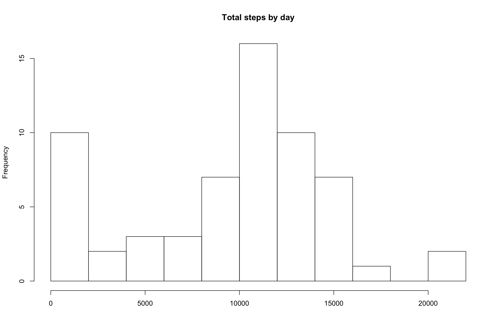
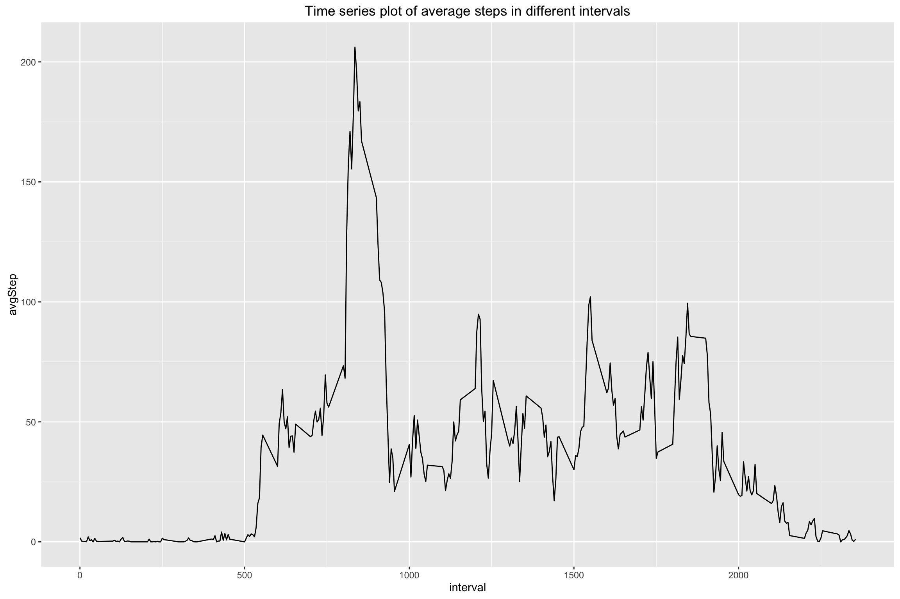
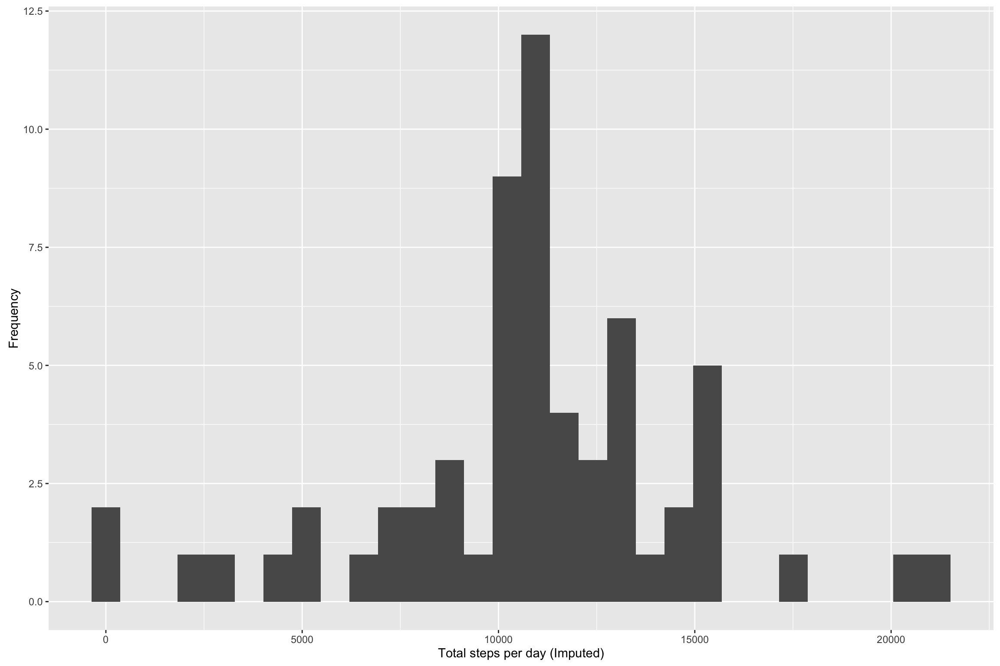
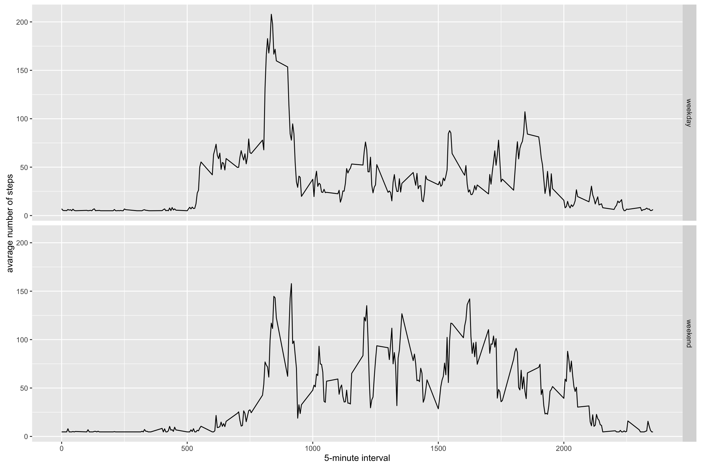

### Coursera Data Science Specialization

### Reproducible Research: assignment 1

#### Loading and preprocessing the data

##### 1. Load the data

If the data has not been dowloaded to this projects location, it can be
found at
<https://d396qusza40orc.cloudfront.net/repdata%2Fdata%2Factivity.zip>.
Simply download the link and unzip the file.

    if(!file.exists('activity.csv')){
      unzip('activity.zip')
    }
    activityData <- read.csv('activity.csv')

##### Code to prepare dataset and/or processing the data

    stepsByDay <- tapply(activityData$steps, activityData$date, sum, na.rm=TRUE)

##### 2. Make a histogram of the total number of steps taken each day

    hist(stepsByDay, 10, main="Total steps by day", xlab="")

##### 3. Mean and median number of steps taken each day

    stepsByDayMean <- mean(stepsByDay)
    stepsByDayMedian <- median(stepsByDay)

-   Mean steps per day: 9354.2295082
-   Median steps per day: 10395

##### 4. Time series plot of the average number of steps taken

    dailyAverageSteps <- tapply(activityData$steps, activityData$interval, mean, na.rm = TRUE, simplify = T)
    df.dailyAverageSteps <- data.frame(interval=as.integer(names(dailyAverageSteps)), avgStep=dailyAverageSteps)

    averageStepsPerTimeBlock <-
      aggregate(x=list(meanSteps=activityData$steps), 
      by=list(interval=activityData$interval), FUN=mean,
      na.rm=TRUE)

    ggplot(df.dailyAverageSteps, aes(x=interval, y=avgStep)) +
        geom_line()+
        labs(title = "Time series plot of average steps in different intervals", xlab("5-minute interval"), ylab("Average steps"))

##### 5. The 5-minute interval that, on average, contains the maximum number of steps

    mostSteps <- which.max(averageStepsPerTimeBlock$meanSteps)
    timeMostSteps <- gsub("([0-9]{1,2})([0-9]{2})", "\\1:\\2", averageStepsPerTimeBlock[mostSteps,'interval'])

-   Most steps at: 8:35

##### 6. Code to describe and show a strategy for imputing missing data

    numMissingValues <- length(which(is.na(activityData$steps)))

-   Number of missing values: 2304

##### Fill in missing values with the mean number of steps taken in the same 5 minute period

    activityDataImputed <- activityData
    activityDataImputed$steps <- impute(activityDataImputed$steps, fun=mean)

##### 7. Make a histogram of the total number of steps taken each day, for the modified data

    stepsByDayImputed <- tapply(activityDataImputed$steps, activityDataImputed$date, sum)
    df.stepsByDayImputed <- as.data.frame(stepsByDayImputed)

    qplot(stepsByDayImputed, xlab='Total steps per day (Imputed)', ylab='Frequency')

##### Calculate and report the mean and median total number of steps taken per day after gaps have been filled with daily mean

    stepsByDayImputedMean <- mean(stepsByDayImputed)
    stepsByDayImputedMedian <- median(stepsByDayImputed)

-   Mean (Imputed): 1.076618910^{4}
-   Median (Imputed): 1.076618910^{4}

##### 8. Panel plot comparing the average number of steps taken per 5-minute interval across weekdays and weekends

First, in the dataset, separate weekdays and weekends

    activityDataImputed$dateType <-  ifelse(as.POSIXlt(activityDataImputed$date)$wday %in% c(0,6), 'weekend', 'weekday')

Make a graph to compare and see if there is a difference

    averagedActivityDataImputed <- aggregate(steps ~ interval + dateType, data=activityDataImputed, mean)
    ggplot(averagedActivityDataImputed, aes(interval, steps)) + 
        geom_line() + 
        facet_grid(dateType ~ .) +
        xlab("5-minute interval") + 
        ylab("avarage number of steps")

